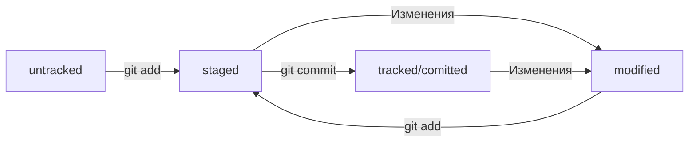

# Установка командной строки для пользователей Windows

1. Скачайте одну из версий из категории *Standalone Installer* на сайте: https://git-scm.com/download/win

2. Запустите программу установки. Обратите внимание, куда будет установлен Git. Обычно это директория C:\Program Files\Git

3. Проверьте, что в списке устанавливаемых программ стоит галочка напротив пункта *Git Bash Here* - это позволит открывать консоль с Git в любой папке.

4. После окончания установки нажмите *Finish*

# Первый запуск Git Bash

1. Запустите программу Git Bash. Сделать это можно двумя способами. Можно ввести название программы в окно поиска на панели задач. А можно открыть директорию, в которой был установлен Git. Перейдите в bin и запустите файл bash exe.

2. Откроется консоль, в которой будет написано что-то похожее *USER_NAME@HOST_NAME MINGW64 ~*

3. Символ *$* означает, что программа ждёт ваших команд

# Команды чтобы не запутаться

- pwd - поможет узнать где вы сейчас находитесь
- cd - для перехода в другие папки (пример: cd /projects/github), (cd ~ переход сразу в домашнюю директорию), если в названии папки пробелы используйте "", (cd . чтобы обратиться к текущей директории)
- ls - вывести содержимое директории (ls -a вывести скрытые файлы), (ls ~ выведет содержимое домашней директории), (ls .. покажет содержимое родительской директории)

# Создание файлов и директорий

- touch my_new_file.txt - _создание_ _файла_ (хорошей практикой при создании считается указывать его расширение)
- mkdir new_dir - создание директории под названием new_dir, (mkdir -p dir1/dir_inside/dir_deeper создание папки dir_deeper в папке dir_inside, которая в папке dir1)

# Копирование файлов 

- cp что_копируем куда_копируем (cp index.html src/ скопировали index.html в папку src), (можно указать сразу несколько файлов)

# Перемещение файлов и папок

- mv table.csv ./ very_important_files (указываем имя файла, который хотим переместить, потом путь - куда перемещаем)

# Операции с папками и файлами: чтение и удаление

- cat myfile.txt - распечатали содержимое файла myfile.txt
- rm example.txt - удалили файл example.txt из текущей папки
- rmdir images - команда удалит папку images из текущей директории, если папка images пуста
- rm -r images - удалит папку images со всем её содержимым из текущей директории

* Удаление объектов командами rm и rmdir необратимо -  в этом случае файлы и папки не попадают в корзину и исчезают навсегда.

* Команды в терминале можно указывать не по одной, а срзу списком, для этого их нужно разделить двумя амперсандами &&.

* С помощью стрелок вверх и вниз можно перемещаться между командами введёнными в терминал ранее.

# Настройка Git

Сейчас вы работает в одиночку, но в дальнейшем вам может понадобиться использовать Git в команде. Чтобы участникам 
проекта было понятно, кто и какие изменения вносил, нужно представиться и указать имя пользователя и адрес электронной почты.

Вы можете указать любую электронную почту и любое имя. Сделать этом можно с помощью команды git config с ключом --global
При этом не имеет значения, в какой директории вы находитесь прямо сейчас: *git config --global* сработает везде.

В качестве значения user.name нужно указать своё имя или никнейм. Для настройки параметра user.email указывают электронную почту.

- git config --global user.name "User Ivan"
- git cinfig --global user.email username@yabdex.ru

Все глобальные настройки Git хранит в файле *.gitconfig* в домашней директории. Команда запишет в этот файл указанные имя и почту.
Чтобы убедиться в этом, можно вызвать команду для чтения файлов.

- git ~/.gitconfig

Другой способ проверки - вывести содержимое файла конфигурации Git той же командой git config с фдагом --list.

- git config --list

В ответ командная строка покажет текущие значения настроек.

user.name=Username
user.email=username@yandex.ru 

# Инициализируем репозиторий

## Сделать папку репозиторием

Чтобы Git начал отслеживать изменения в проекте, папку с файлами этого проекта нужно сделать Git-репозиторием.
Для этого следует переместиться в неё и ввести команду git init.

Например, создайте папку first_project и сделайте её Git-репозиторием:
перейдите в ней с помощью команды cd и выполните git init.

- cd ~/dev/first_project (перешли в нужную папку)
- git init (создали репозиторий)

## Разгитить папку, если что-то пошло не так

Если вы случайно сделали Git-репозиторием не ту папку, её можно «разгитить».
Для этого нужно удалить скрытую подпапку .git.

- cd <папка с репозиторием>
- rm -rf .git (удалили подпапку .git)

Разберём подробнее, что такое -rf:

* ключ -r позволяет удалять папки вместе с их содержимым
* ключ -f избавит вас от вопросов вроде "Вы точно хотите удалить файл?"

Будьте осторожны: в подпапке .git хранится история изменений. 
Если удалить .git, то вся история проекта будет стёрта без возможности восстановления — останется только последняя версия файлов.

## Проверить состояние репозитория

- git status (показывает текущее состояние репозитория)

Команда git status выведет:
* название текущей ветки: On branch master или On branch main;
* сообщение о том, что в репозитории ещё нет коммитов: No commits yet;
* сообщение, которое говорит: «чтобы что-нибудь закоммитить (то есть зафиксировать), нужно сначала это создать» — nothing to commit (create/copy files and use "git add" to track).

# Добавляем файлы в репозиторий

## Подготовить файлы к сохранению

- git add --all (подготовили к сохранению все файлы в репозитории), (можно без -all просто название файла)
- git status (проверили статус)

* Файлы отмеченные зелённым, теперь отслеживаются и готовы к сохранению. Но сохранения пока не произошло, потому что команда git add только запоминает текущее содержимое (контент) файла.

# Делаем первый коммит

## Выполнить коммит

- git commit -m "Комментарий к комиту"

После нажатия Enter текущая версия файлов будет сохранена в репозитории с сообщением Комментарий к комиту. Коммит (по названию команды git commit) — это по сути список файлов с их контентом.

Команда git commit выведет информацию о коммите.
* [master (root-commit) baa3b6e] значит:
* коммит был в ветке master;
* root-commit — это самый первый, или «корневой» (англ. root), коммит в ветке, у следующих коммитов такой надписи не будет;
* baa3b6e — сокращённый идентификатор коммита (подробнее об этом мы ещё расскажем).
* 2 files changed, 1 insertion(+) значит:
* изменились два файла (readme.txt и todo.txt);
* одна строка была добавлена (1. Пройти пару уроков по Git.).
* Строки вида create mode 100644 readme.txt — это более подробная информация о новых (добавленных в Git) файлах.
* create (англ. «создать») говорит, что файл был создан. Если бы файл был удалён, на этом месте было бы слово delete (англ. «удалить»).
* mode 100644 сообщает, что это обычный файл. Также возможны варианты 100755 для исполняемых файлов (например, что-нибудь.exe) и 120000 для файлов-ссылок в Linux. Файлы-ссылки не содержат данных сами по себе, а только ссылаются на другие файлы — как «ярлыки» в Windows.

Сначала команда git add сообщает Git, какие именно файлы нужно сохранить и какую их версию. Затем с помощью команды git commit происходит само сохранение. 

## Посмотреть историю коммитов

- git log (выведет комментарий и основную информацию о коммитах)

# Связываем локальный и удалённый репозитории

## Привязать удалённый репозиторий к локальному 

- git remote add origin git@github.com:%ИМЯ_АККАУНТА%/first-project.git
- git remote -v (убедиться, что репозитории связаны), (-v короткая форма флага --verbose "подробный")

# Синхронизируем локальный и удалённый репозитории

## Основная ветка

Мы упоминали, что каждый коммит сохраняет актуальное состояние файлов. Сами же коммиты хранятся в ветках (англ. branch).
Если коммит — это снимок состояния файлов, то ветка — временна́я шкала, на которой расположены эти снимки. Ветка всегда начинается от одного из коммитов.
В репозитории может существовать сразу несколько веток — параллельных историй изменений. Также они могут соединяться друг с другом.
Самая первая ветка в репозитории появляется автоматически и называется main (англ. «основная») или master. Её имя нужно указывать при отправке коммитов на удалённый репозиторий или при получении их из него.

## Отправить изменения на удалённый репозиторий

- git push -u origin main (если команда приведёт к ошибке, попробуйте заменить main на master)

В первый раз эту команду нужно вызвать с флагом -u и параметрами origin (имя удалённого репозитория) и main или master (название текущей ветки). 
Флаг -u свяжет локальную ветку с одноимённой удалённой. Как вы связывали локальный и удалённый репозитории в предыдущем уроке, так же и здесь нужно дополнительно связать ветки.

Зайдите в репозиторий first-project на GitHub. Вы увидите, что в репозитории появились файлы с изменениями.

## Файл README.md

Чтобы другие пользователи, а также потенциальные клиенты или работодатели могли понять, что представляет собой проект, его нужно описать. 
Такое описание принято указывать в файле README.md (от англ. read — «прочитай» и me — «меня»).

Подробнее о том, зачем нужен README.md:

1. Название проекта и его краткое описание: кем создан, для чего, какие решает задачи и какие закрывает проблемы.
2. Технологии, которые применяются в проекте. В чём его отличие от аналогичных.
3. Документация проекта — подробная инструкция о том, что представляет собой проект.
4. Планы проекта, если они есть.

Пример файла README.md - [Пример](https://github.com/git/git/blob/master/README.md "Пример файла README.md")

README.md — текстовый файл, который можно создать командой touch, а затем редактировать так же, как и любой другой текстовый документ. Например, в блокноте.

Преимущество README.md в том, что средства командной работы (такие, как GitHub) могут отображать его содержимое в браузере в виде удобной разметки. 
Для этого нужно не просто залить текст, но и настроить шрифт, заголовки и отступы с помощью markdown. Маркда́ун — это специальный язык разметки. 
Он позволяет красиво отформатировать текстовый документ.

Основные инструменты и как ими пользоваться: [здесь](https://www.markdownguide.org/cheat-sheet/ "Шпаргалка по markdown!") и [здесь](https://gist.github.com/fomvasss/8dd8cd7f88c67a4e3727f9d39224a84c "Гайд по использованию").

# Хеш - идентификатор коммита

В процессе работы с Git вам будет часто встречаться понятие «хеш коммита».
Эти странные строчки с бессмысленным (на первый взгляд) набором букв и цифр вы могли видеть, когда вызывали команду git log и выводили историю коммитов.

## Что такое хеш. Хеширование коммитов.

Хеширование (от англ. hash, "рубить", "крошить", "мешанина") - это способ преобразовать набор данных и получить их "отпечаток".

Информация о коммите — это набор данных: когда был сделан коммит, содержимое файлов в репозитории на момент коммита и ссылка на предыдущий, или родительский (англ. parent), коммит.

Git хеширует (преобразует) информацию о коммите с помощью алгоритма SHA-1 (от англ. Secure Hash Algorithm — «безопасный алгоритм хеширования») и получает для каждого коммита свой уникальный хеш — результат хеширования.

Обычно хеш — это короткая (40 символов в случае SHA-1) строка, которая состоит из цифр 0—9 и латинских букв А - F (неважно, заглавных или строчных).
Она обладает следующими важными свойствами:

* если хеш получить дважды для одного и того же набора входных данных, то результат будет гарантированно одинаковый;
* если хоть что-то в исходных данных поменяется (хотя бы один символ), то хеш тоже изменится (причём сильно).

Чтобы убедиться в этом, можно поэкспериментировать с SHA-1 на этом [сайте](https://emn178.github.io/online-tools/sha1.html) — попробуйте ввести в поле input (англ. «ввод») разные символы, слова или предложения и понаблюдайте, как меняется хеш в поле output (англ. «вывод»).

## Хеш - основной идентификатор коммита

Git хранит таблицу соответствий хеш → информация о коммите. Если вы знаете хеш, вы можете узнать всё остальное: автора и дату коммита и содержимое закоммиченных файлов. Можно сказать, что хеш — основной идентификатор коммита.

При работе с Git хеши будут встречаться вам регулярно. Их можно будет передавать в качестве параметра разным Git-командам, чтобы указать, с каким коммитом нужно произвести то или иное действие.

Все хеши и таблицу хеш → информация о коммите Git сохраняет в служебные файлы. Они находятся в скрытой папке .git в репозитории проекта.

# Исследуем лог

После вызова git log появляется список коммитов.

Разберём элементы, из которых состоит описание:
* строка из цифр и латинских букв после слова commit — это хеш коммита;
* Author — имя автора и его электронная почта;
* Date — дата и время создания коммита;
* в конце находится сообщение коммита.

## Получить сокращенный лог

- git log --oneline (получить сокращённый лог, флаг --oneline значит "одной строкой")

В терминале появятся только первые несколько символов хеша каждого коммита и их комментарии.
Сокращённый лог полезен, если в репозитории уже много коммитов — например, сотни или тысячи. В этом случае можно быстро найти нужный по описанию.

Сокращённый хеш (то есть первые несколько символов полного) можно использовать точно так же, как и полный. 
Для этого команда git log --oneline автоматически подбирает такую длину сокращённых хешей, чтобы они были уникальными в пределах репозитория и Git всегда мог понять, о каком коммите идёт речь.

* Обратите внимание: если выход из просмотра логов не произошёл автоматически, нажмите клавишу Q (от англ. Quit — «выйти») в английской раскладке клавиатуры.

# HEAD - всему голова

При вызове команды git log вы также могли заметить надпись (HEAD -> master) после хеша одного из коммитов.

Файл HEAD (англ. «голова», «головной») — один из служебных файлов папки .git. Он указывает на коммит, который сделан последним (то есть на самый новый).
В этом можно убедиться с помощью терминала. Перейдите в папку .git командой cd. Посмотрите содержимое файла HEAD командой cat.

- cd .git/
- ls
- cat HEAD (в файле будет такая ссылка: ref: refs/heads/master)

Внутри HEAD — ссылка на служебный файл: refs/heads/master (или refs/heads/main в зависимости от названия ветки).
Если заглянуть в этот файл, можно увидеть хеш последнего коммита.

Когда вы делаете коммит, Git обновляет refs/heads/master — записывает в него хеш последнего коммита. Получается, что HEAD тоже обновляется, так как ссылается на refs/heads/master.
При работе с Git указатель HEAD используется довольно часто. Мы уже упоминали, что многие команды Git принимают в качестве параметра хеш коммита.
Если нужно передать последний коммит, то вместо его хеша можно просто написать слово HEAD — Git поймёт, что вы имели в виду последний коммит.

# Статусы файлов в Git

До появления Git системы контроля версий выделяли только два статуса у файлов: «уже закоммичен» и «ещё не закоммичен». Например, в Subversion (самой популярной VCS до эпохи Git) не нужно было выполнять команду — аналог git add, а можно было просто сделать коммит (svn commit). Эта команда по умолчанию добавляла в коммит все новые и изменённые файлы.
Такое поведение интуитивно более понятно. Зато Git даёт больше контроля за состоянием файлов. Хотя сначала это может показаться сложным, со временем вы оцените удобство более явного подхода.

Одна из ключевых задач Git — отслеживать изменения файлов в репозитории.
Для этого каждый файл помечается каким-либо статусом. Рассмотрим основные.

Статусы:

* *untracked* (англ. «неотслеживаемый») Мы говорили, что новые файлы в Git-репозитории помечаются как untracked, то есть неотслеживаемые. Git «видит», что такой файл существует, но не следит за изменениями в нём. У untracked-файла нет предыдущих версий, зафиксированных в коммитах или через команду git add.
* *staged* (англ. «подготовленный») После выполнения команды git add файл попадает в staging area (от англ. stage — «сцена», «этап [процесса]» и area — «область»), то есть в список файлов, которые войдут в коммит. В этот момент файл находится в состоянии staged.
* *tracked* (англ. «отслеживаемый») Состояние tracked — это противоположность untracked. Оно довольно широкое по смыслу: в него попадают файлы, которые уже были зафиксированы с помощью git commit, а также файлы, которые были добавлены в staging area командой git add. То есть все файлы, в которых Git так или иначе отслеживает изменения.
* *modified* (англ. «изменённый») Состояние modified означает, что Git сравнил содержимое файла с последней сохранённой версией и нашёл отличия. Например, файл был закоммичен и после этого изменён.

- Staging area, index и cache Staging area также называют index (англ. «каталог») или cache (англ. «кеш»), а состояние файла staged иногда называют indexed или cached. Все три варианта могут встречаться в документации и в качестве флагов команд Git. А также в интернете — например, в вопросах и ответах на сайте Stack Overflow.
- Команда git add добавляет в staging area только текущее содержимое файла. Если вы, например, сделаете git add file.txt, а затем измените file.txt, то новое содержимое файла не будет находиться в staging. Git сообщит об этом с помощью статуса modified: файл изменён относительно той версии, которая уже в staging. Чтобы добавить в staging последнюю версию, нужно выполнить git add file.txt ещё раз.

Типичный жизненный цикл файла в Git.

1. Файл только что создали. Git про него ещё ничего не знает. Состояние: *untracked*.
2. Файл добавили в staging area с помощью *git add*. Состояние: *staged* (+ *tracked*).
    * Возможно, изменили файл ещё раз. Состояния: *staged*, *modified* (+ *tracked*).
    * Обратите внимание: *staged* и *modified* у одного файла, но у разных его версий.
    * Ещё раз выполнили *git add*. Состояние: *staged* (+ *tracked*).
3. Сделали коммит с помощью *git commit*. Состояние: *tracked*.
4. Изменили файл. Состояние: *modified* (+ *tracked*).
5. Снова добавили в *staging area* с помощью *git add*. Состояния: *staged* (+ *tracked*).
6. Сделали коммит. Состояния: *tracked*.

# Как исправить коммит

Иногда в только что выполненном коммите нужно что-то поменять: например, добавить ещё пару файлов или заменить сообщение на более информативное.
В таком случае можно внести правки в уже сделанный коммит с помощью опции --amend (от англ. amend — «исправить», «дополнить») у команды commit: git commit --amend.

* Важно: опция --amend работает только с последним коммитом (HEAD). Для исправления более ранних коммитов есть другие команды. Мы рассмотрим их в следующих модулях курса.
 
**Дополнить коммит новыми файлами:**

Представим, что в какой-то момент вы забыли добавить в коммит какой-нибудь файл, в этом случае:

- добавляем забытый файл командой git add
- затем выполняем команду git commit --amend --no-edit

После этого в истории коммитов измениться только хеш последнего коммита.

С опцией --amend команда commit не создаст новый коммит, а дополнит последний, 
просто добавив в него файл который вы перед этим добавили. При этом хеш последнего коммита изменится, потому что изменился список файлов в коммите.

Обратите внимание на опцию --no-edit. Она сообщает команде commit, что сообщение коммита нужно оставить как было.

* В нашем примере вместо изменения последнего коммита можно было также выполнить новый коммит с одним файлом (пропущенным). Кажется, что так проще, но добавить изменения в уже существующий коммит может быть правильнее.
 Например, через месяц кто-то захочет просмотреть историю изменений. Намного проще понять, что изменилось, если оба файла находятся в одном коммите. Иначе коммит со второй порцией изменений придётся искать.

**Изменить сообщение коммита:**

Может быть и так, что добавлять новые файлы в коммит не нужно, зато понадобилось изменить сообщение.

Допустим, хочется заменить сообщение *Добавить главную страницу* на *Добавить главную страницу и стили*. Сделать это можно через *commit --amend* с флагом *-m*.

- git commit --amend -m "Добавить главную страницу и стили"

**Случилось страшное: открылся редактор**

Если забыть указать у команды *git commit --amend* один из флагов (*--no-edit или -m*), Git предложит отредактировать сообщение коммита вручную. Для этого он откроет текстовый редактор, который установлен в системе по умолчанию. Чаще всего это либо GNU nano, либо Vim.

**nano - простой и свободный:**

Первая строка *Добавить главную страницу и стили* — это текущее сообщение коммита. Если вы хотите изменить сообщение, нужно отредактировать эту строку.

Допустим, решили добавить в конце сообщения восклицательный знак. Чтобы сохранить новое сообщение, нужно нажать *Ctrl+X*, где *X* значит exit (англ. «выход»).

* В надписях вида ^X, ^G и других «шляпка» ^ обозначает кнопку Ctrl. То есть ^X — это то же самое, что и Ctrl+X.

После нажатия *Ctrl+X* nano предложит сохранить файл, для этого нужно нажать Y (от англ. yes).

Затем редактор предложит изменить имя файла, но делать этого не нужно — просто нажмите Enter.

* 💡 Если вы не хотите менять сообщение через редактор, можно выйти из него с помощью *Ctrl+X*, а затем выбрать N (от англ. no). В таком случае редактор закроется, и Git оставит сообщение последнего коммита «как было».

**Vim - великий и ужасный**

Если не откроется nano, то, скорее всего, откроется Vim.

Если вы ещё не умеете пользоваться Vim, мы рекомендуем сразу выйти из редактора и использовать флаг -m для указания сообщений коммита. Вот как выйти из Vim:
1. Нажмите клавишу Esc.
2. Наберите последовательность символов :qa!.
3. Нажмите Enter.

После нажатия Enter редактор должен закрыться, а вы сможете продолжить работу так, как будто ничего и не открывалось.

* Vimtutor Редактор Vim — полезный инструмент, но его интерфейс сложно назвать интуитивным. И всё же во многих дистрибутивах это текстовый редактор по умолчанию. Если ваша текущая или будущая профессия связана с работой в консоли Linux, рекомендуем заглянуть в учебник по работе с Vim. Для запуска учебника на русском языке достаточно выполнить команду vimtutor ru. Без ru запустится английская версия.

- Как добавить новый файл в последний коммит? - Убедиться, что файл в staged, и выполнить git commit --amend --no-edit
- Как изменить сообщение последнего коммита? - git commit --amend -m "новое сообщение"

Небольшой итог:

- --amend рассчитан на работу с последним коммитом (HEAD).
- Дополнить коммит новыми файлами можно с помощью git commit --amend --no-edit. Благодаря опции --no-edit сообщение к коммиту останется таким, каким и было.
- Изменить сообщение к коммиту позволяет команда git commit --amend -m "Обновлённое сообщение коммита"

# Как откатиться назад, если "всё сломалось"

На разных этапах работы с Git могут происходить похожие ситуации:

* В список на коммит попал лишний файл (например, временный). Нужно «вынуть» его из списка.
* Последние несколько коммитов ошибочные: например, сделали не то, что было нужно, или нарушили логику. Хочется «откатить» сразу несколько коммитов, вернуть «как было вчера».
* Случайно изменился файл, который вообще не должен был меняться. Например, вы открыли не тот файл в редакторе и начали его исправлять.

В этом уроке рассмотрим такие случаи и научим вас «откатывать» нежелательные изменения.

**Выполнить unstage изменений**

- git restore --staged <file>

Допустим, вы создали или изменили какой-то файл и добавили его в список «на коммит» (staging area) с помощью *git add*, но потом передумали включать его туда. Убрать файл из staging поможет команда *git restore --staged <file>* (от англ. restore — «восстановить»).

* В выводе команды *git status* есть подсказка в скобках: *use "git restore --staged <file>..." to unstage*. Так что, даже если вы и забыли эту команду, Git напомнит вам.

* Чтобы «сбросить» все файлы из staged обратно в *untracked/modified*, можно воспользоваться командой *git restore --staged .*: она сбросит всю текущую папку (.).

*  Раньше для этой операции использовали команду *git reset HEAD*. Но *git reset* «перегруженная»: она умеет делать много разных действий в зависимости от переданных параметров. Чтобы было меньше путаницы, в Git была добавлена отдельная команда *git restore*.

**"Откатить" коммит**

- git reset --hard <commit hash>

Иногда нужно «откатить» то, что уже было закоммичено, то есть вернуть состояние репозитория к более раннему. Для этого используют команду *git reset --hard <commit hash>* (от англ. reset  — «сброс», «обнуление» и hard — «суровый»).

После использования *git reset --hard <commit hash>* последним коммитом станет предпоследний до использования команды.

* Будьте осторожны с командой *git reset --hard*! При удалении коммитов можно потерять что-то нужное.

**"Откатить" изменения, которые не попали ни в staging, ни в коммит**

- git restore <file>

Может быть так, что вы случайно изменили файл, который не планировали. Теперь он отображается в *Changes not staged for commit (modified)*. Чтобы вернуть всё «как было», можно выполнить команду *git restore <file>*.

Изменения в файле «откатятся» до последней версии, которая была сохранена через *git commit* или *git add*.

- Вы сделали коммит, после которого «всё сломалось». Какую команду использовать, чтобы «откатить» репозиторий на более ранний коммит? - git reset --hard <более ранний коммит>
- Вы добавили изменения в staging area и хотите вернуть их в modified. Какую команду выбрать? - git restore --staged <файл>
- Вы случайно изменили файл, который вообще не хотели менять. Но в staging его пока не добавили. Какую команду нужно выполнить? - git restore <файл>

Небольшой итог:

* Команда *git restore --staged <file>* переведёт файл из *staged* обратно в *modified* или *untracked*.
* Команда *git reset --hard <commit hash>* «откатит» историю до коммита с хешем *<hash>*. Более поздние коммиты потеряются!
* Команда *git restore <file>* «откатит» изменения в файле до последней сохранённой (в коммите или в staging) версии.

